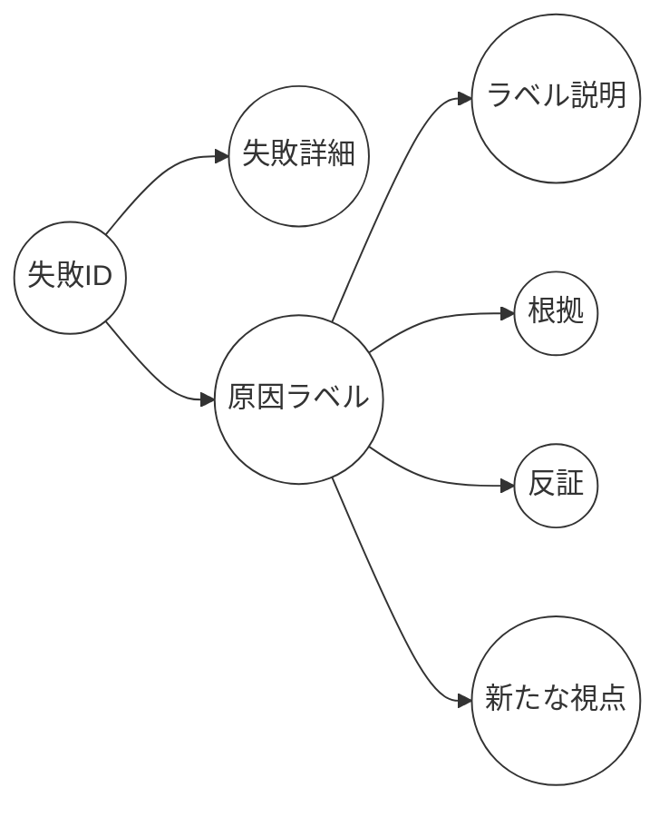

以下は、要件定義・仕様書のような形式でまとめた内容です。大まかなフローと画面・機能の概要、LLMとの連携方法を記載しています。実装の詳細やUIデザインは別途検討が必要ですが、全体像を把握できるドキュメントとしてご活用ください。

---

# 失敗分析アプリ 仕様書（案）

## 1. 概要

本仕様書は、ユーザーが「失敗の詳細」を入力し、原因を整理（Bフェーズ）したうえで、新たな視点（Dフェーズ）を見いだすまでの一連のフローを定義したものです。ユーザーの入力をサポートするためにLLMを活用し、サジェスト機能や要約生成などを行います。

---

## 2. 全体フロー

1. **(A) 失敗の詳細入力**  
   - 失敗に関する客観的事実を入力（LLMサジェストは原則無し。入力補完などは検討）  
   - 入力完了後、次の画面へ遷移

2. **(B) 原因に対する意見を整理**  
   - **B-1:** LLMが失敗の詳細を要約し、内的要因5個＋外的要因5個（計10個）の原因ラベルを自動生成  
   - ユーザーがそれらの中から最大3つを選択（自由に追加も可）  
   - **B-2:** 選択したラベルごとに詳細説明を入力（LLMサジェストあり）  
   - 入力完了後、次の画面へ遷移

3. **(D) 原因に対する新たな視点を探索**  
   - **D-1:** Bで入力したラベルごとに「根拠」を入力（LLMサジェストあり）  
   - **D-2:** 同様に「反証される可能性」を入力（LLMサジェストあり）  
     - ここでは、直前に入力した「根拠」を加味してLLMが反証のサジェストを出す  
   - 入力完了後、最終画面へ遷移

4. **最終画面（原因の整理）**  
   - 画面上部に失敗の詳細の要約を表示  
   - 下部に「最初の視点（B）」と「新たな視点（D）」を2列で表示  
   - 各列にはラベルがカード形式で並び、タップで詳細（説明、根拠 or 反証）を折りたたみ表示  
   - LLMはこれらのセット（失敗の詳細要約・ラベル・説明・根拠・反証）を入力とし、**新たな視点**をラベルごとに1つずつ生成  
   - ユーザーは生成された新たな視点を参考に、自由に原因を追加入力したり、ドラッグ＆ドロップで既存ラベルをまとめたりできる  
   - 「保存」ボタンを押すと、失敗の記録（失敗詳細と原因一覧）が閲覧できる画面に移行

---

## 3. 各フェーズの詳細

### 3.1 (A) 失敗の詳細入力

- **目的:**  
  失敗した状況や経緯など、客観的事実を記録する  
- **入力項目（例）:**  
  1. タイトル（必須）  
  2. 失敗のあらまし（自由記述）  
  3. 時間・場所・関係者（必要に応じて）  
- **LLMとの連携:**  
  - 原則、客観的事実のみのため、LLMによるサジェストは想定しない  
  - ただし、**入力補完（GitHub Copilot的機能）**を検討できるが、技術的ハードルが高い  
- **遷移:**  
  入力を完了すると、次の「(B) 原因に対する意見を整理」画面へ遷移

---

### 3.2 (B) 原因に対する意見を整理

#### 3.2.1 B-1 原因ラベルの選択

1. **LLM入力:**  
   - 失敗の詳細を要約したテキストをLLMに渡す  
   - 「内的要因（自己）」5個、「外的要因（環境・他者）」5個、合計10個のラベルを生成  
2. **ユーザー操作:**  
   - LLMが提案した10個のラベルの中から、ユーザーが最大3つを選択  
   - 必要に応じて、ユーザー自身がラベルを追加  
3. **UI例:**  
   - カードまたはタグ形式で10個のラベルが表示され、ユーザーはクリックで選択  
   - 選択したラベルの色が変わる

#### 3.2.2 B-2 ラベルの詳細説明入力

1. **LLM入力:**  
   - 失敗の詳細要約＋選択されたラベル をLLMに渡し、各ラベルに対する説明のサジェストを生成  
2. **ユーザー操作:**  
   - ラベルごとにタブ切り替え or ページ切り替えで「説明入力欄」を表示  
   - 入力欄の下にLLMサジェスト（複数候補）を表示  
   - ユーザーはサジェストを選ぶか、自由に編集・入力して確定  
3. **UI例:**  
   - 画面上部：ラベル一覧（タブ or 横並び）  
   - 中央：選択中のラベルの説明入力エリア  
   - 下部：LLMサジェストの候補一覧

---

### 3.3 (D) 原因に対する新たな視点を探索

#### 3.3.1 D-1 根拠の入力

1. **LLM入力:**  
   - 失敗の詳細要約＋(B)で確定したラベルとその説明 をまとめてLLMに渡す  
   - 各ラベルについて、その意見を支持する「根拠」のサジェストを生成  
2. **ユーザー操作:**  
   - ラベルごとにタブ切り替え or ページ切り替え  
   - 「根拠」入力欄の下にLLMサジェストを表示  
   - ユーザーがサジェストを選択 or 編集し、最終的な「根拠」を確定  
3. **UI例:**  
   - Bフェーズ同様、ラベルタブを切り替えながら入力  
   - 「根拠」と「反証される可能性」の切り替えスイッチを用意する場合は、この段階では「根拠」モードにしておく

#### 3.3.2 D-2 反証される可能性の入力

1. **LLM入力:**  
   - 失敗の詳細要約＋ラベル・説明＋直前で入力した「根拠」をあわせてLLMに渡し、**反証される可能性**のサジェストを生成  
2. **ユーザー操作:**  
   - 同じくラベルごとにタブ切り替え  
   - 「反証」入力欄の下にLLMサジェストを表示  
   - ユーザーがサジェストを選択 or 編集し、最終的な「反証される可能性」を確定  
3. **UI例:**  
   - 「根拠」タブと「反証」タブをスイッチで切り替え可能  
   - 画面構成はD-1と類似

---

### 3.4 最終画面（原因の整理）

1. **表示内容**  
   - 画面上部: 失敗の詳細要約  
   - その下に、左右2列で「最初の視点（B）」と「新たな視点（D）」を表示  
   - **最初の視点（B）**:  
     - ユーザーが選択したラベルのカードが縦に並ぶ  
     - カードをタップすると、ラベルの説明と「根拠」を折りたたみで表示  
   - **新たな視点（D）**:  
     - 同様にラベルのカードを並べ、タップで説明と「反証される可能性」を表示  
2. **LLMからの新たな視点生成**  
   - 失敗の詳細要約、ラベル、ラベルの説明、根拠、反証のセットをLLMに渡し、**「それぞれのラベルに対する新たな視点」**を1つずつ生成  
   - 生成された新たな視点は、各ラベルカードの下に表示する or 別のUIでまとめて提示  
3. **ユーザーの操作**  
   - 生成された新たな視点を参考に、ユーザーが自由に原因を追加する or 既存ラベルをドラッグ&ドロップで並び替え可能  
   - 「保存」ボタンを押すと、失敗の記録画面へ遷移  
4. **画面イメージ例**  
   ```
   ┌───────────────────────────────────┐
   │ [失敗の詳細要約]                                            │
   ├───────────────────────────────────┤
   │ 最初の視点（B）                | 新たな視点（D）               │
   │ ┌─ ラベルカード1 ──────┐   | ┌─ ラベルカード1 ──────┐  │
   │ │ 説明＋根拠(折りたたみ)    │   | │ 説明＋反証(折りたたみ)   │  │
   │ └────────────────────┘   | └────────────────────┘  │
   │ ┌─ ラベルカード2 ──────┐   | ┌─ ラベルカード2 ──────┐  │
   │ │ ...                  │   | │ ...                  │  │
   │ └────────────────────┘   | └────────────────────┘  │
   │      ...                     |      ...                  │
   └───────────────────────────────────┘
   [保存] ボタン
   ```

---

## 4. LLM連携の詳細

- **入力**  
  1. 失敗の詳細の要約（ユーザーが入力したもの or システムが抽出したもの）  
  2. ユーザーが選択したラベル、およびその説明  
  3. Dフェーズで入力された「根拠」や「反証される可能性」  

- **出力**  
  1. B-1: 原因ラベル10個（内的5／外的5）  
  2. B-2: 各ラベルの説明サジェスト  
  3. D-1: 各ラベルの根拠サジェスト  
  4. D-2: 各ラベルの反証サジェスト  
  5. 最終画面: 各ラベルに対する新たな視点（1つずつ）  

- **プロンプト例**  
  - B-1:  
    ```
    User Input: "失敗の詳細（要約）"
    Prompt: "上記の失敗に関して、内的要因5つ、外的要因5つの合計10個の原因ラベルを提案してください。"
    ```
  - B-2:  
    ```
    User Input: "失敗の詳細（要約） + 選択したラベル"
    Prompt: "それぞれのラベルについて、失敗の詳細と関連する説明文を提案してください。"
    ```
  - D-1 / D-2:  
    ```
    User Input: "失敗の詳細（要約） + ラベル + 説明 (+ 根拠)"
    Prompt: "上記の情報を踏まえて、[根拠 / 反証される可能性]を提案してください。"
    ```
  - 最終画面:  
    ```
    User Input: "失敗の詳細（要約） + ラベル + 説明 + 根拠 + 反証"
    Prompt: "それぞれのラベルに対して、新たな視点を1つずつ提案してください。"
    ```

---

## 5. データ構造イメージ



- **失敗ID**: ユニークに識別するキー  
- **失敗詳細**: Aフェーズで入力された内容  
- **原因ラベル**: B-1で選択・追加されたラベル（最大3つ想定）  
- **ラベル説明**: B-2で入力  
- **根拠**: D-1で入力  
- **反証**: D-2で入力  
- **新たな視点**: 最終画面でLLM生成＋ユーザー編集可

---

## 6. ユーザー体験のポイント

1. **段階的入力フロー**  
   - A→B→D→最終画面 というステップを明確にし、ユーザーが混乱しないようUI上でガイドを行う。  
2. **LLMサジェストの柔軟活用**  
   - ユーザーはサジェストをそのまま使うもよし、自分で編集するもよし。サジェストはあくまで補助であり、最終的にはユーザーが自由に決定できる。  
3. **視覚的な整理**  
   - 最終画面では2列表示（Bの視点とDの視点）により、当初の意見と新たな意見を比較しやすくする。  
   - カード形式やタブ切り替えなど、ユーザーがストレスなく操作できるデザインを採用。  
4. **保存後の閲覧画面**  
   - ユーザーが後から失敗記録を見返したときに、「失敗詳細」「原因ラベル」「説明」「根拠」「反証」「新たな視点」が一目でわかるように配置。

---

## 7. 今後の検討事項

- **UIデザイン詳細**: レイアウト、配色、フォント、カードやタブの具体的な設計  
- **LLMモデルの選定**: GPT系か、その他のモデルか。API呼び出し頻度やコストの試算  
- **入力補完の実装難易度**: AフェーズにおけるGitHub Copilot的な入力補完機能の実現性  
- **多言語対応**: 必要に応じてUIやLLMの言語設定をどうするか  
- **セキュリティ・プライバシー**: ユーザーの失敗詳細や要因が機微情報になりうるため、データの保護と取り扱い方針を明確化する

---

## 8. まとめ

本仕様書では、失敗分析アプリにおいて「失敗の詳細入力 (A)」「原因に対する意見の整理 (B)」「新たな視点の探索 (D)」を行う際のフローと画面設計、およびLLM連携の概要を示しました。段階的な入力ステップと、LLMサジェストによるユーザーサポートを組み合わせることで、ユーザーが失敗から学びを得やすい仕組みを提供します。今後は、実装段階でUIデザインやデータベース設計、LLMモデル選定などを詰めつつ、ユーザーフィードバックを得ながら改善を進めることを想定しています。